# Kapo learning platform

Application for building a learning platform for students and teachers. Kahoot clone.

## Features

- ✅ User authentication
- ✅ Create a quiz
- ✅ Join a quiz
- ✅ View quiz results
- ✅ View quiz history
- ✅ View quiz leaderboard
- ✅ View quiz statistics

## Technologies Used

- Angular 16
- Material UI
- Layered Architecture

## Project Structure

```
src/
├── core/
│   ├── DTO/
│   ├── mapper/
│   ├── models/
│   ├── service/
│   └── util.ts
├── data/
│   ├── model/
│   ├── network/
│   │   ├── api/
│   │   ├── auth/
│   │   │   ├── body/
│   │   │   └── result/
│   └── repository/
├── navigation/
├── ui/
│   ├── app/
│   │   ├── app-routing.module.ts
│   │   ├── app.component.css
│   │   ├── app.component.html
│   │   ├── app.component.ts
│   │   ├── app.module.ts
│   │   ├── common/
│   │   ├── directive/
│   │   ├── enum/
│   │   ├── home/
│   │   ├── login/
│   │   ├── players-report/
│   │   └── features/
│   ├── MainActivity.kt
│   ├── common/
│   └── theme/
└── util/
```

The project structure is organized into several layers:

### Core Layer

The `core` layer contains essential components such as `DTO`, `mapper`, `models`, `service`, and utility functions (`util.ts`).

### Data Layer

The `data` layer is structured to handle data-related operations. It includes directories for `model`, `network`, `api`, `auth`, `body`, `result`, and `repository`.

### UI Layer

The `ui` layer manages the user interface components. It includes the main application files (`app`), common utilities (`common`), directives (`directive`), enumerations (`enum`), and various feature modules such as `home`, `login`, `players-report`, and other `features`. Additionally, it contains the main activity file (`MainActivity.kt`) and theme-related files (`theme`).

### Navigation Layer

The `navigation` layer is designated for navigation-related files.

### Util Layer

The `util` layer is intended for utility functions and extensions.

## Screenshots

|                                                     |                                                   |                                                     |
| :-------------------------------------------------: | :-----------------------------------------------: | :-------------------------------------------------: |
|                    Login Screen                     |                    Home Screen                    |                    Store Screen                     |
|         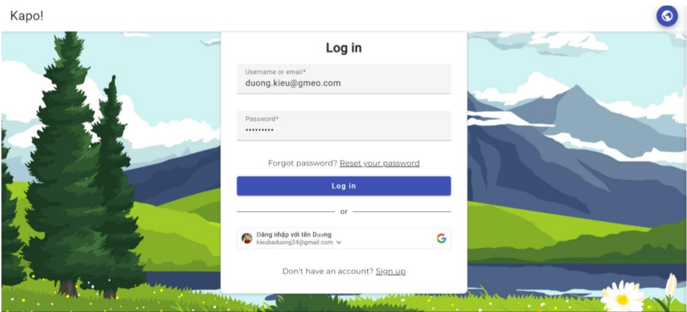          |         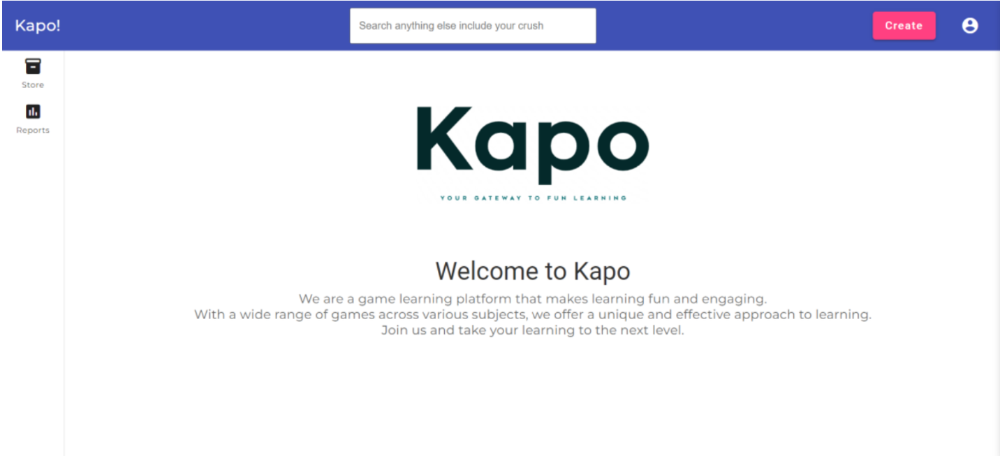         |         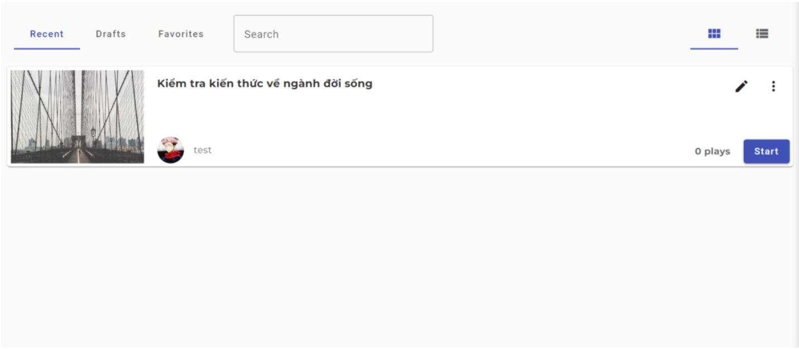          |
|                   Template Screen                   |                Add Question Screen                |                   Add Quiz Dialog                   |
|        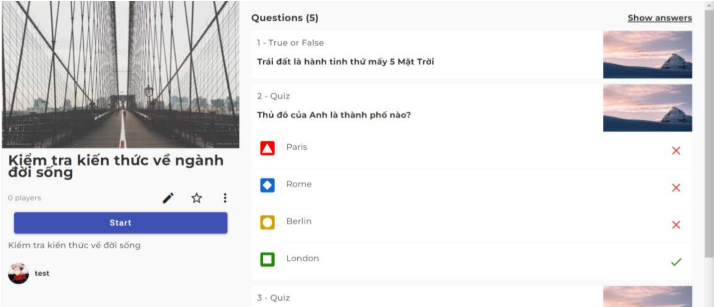        |       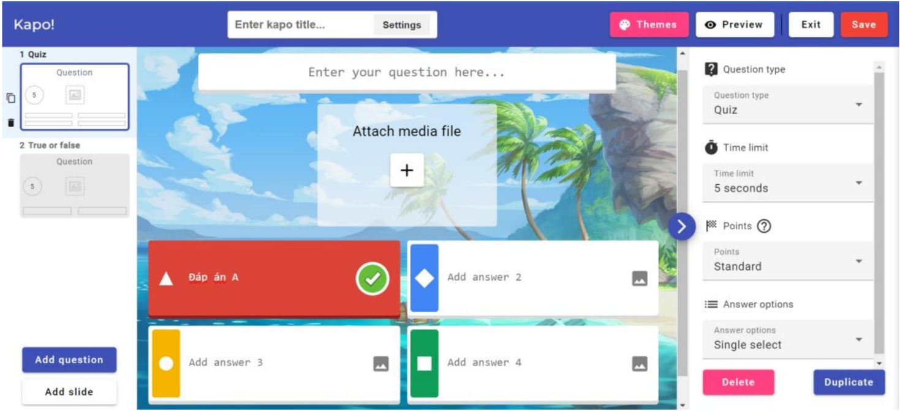       |        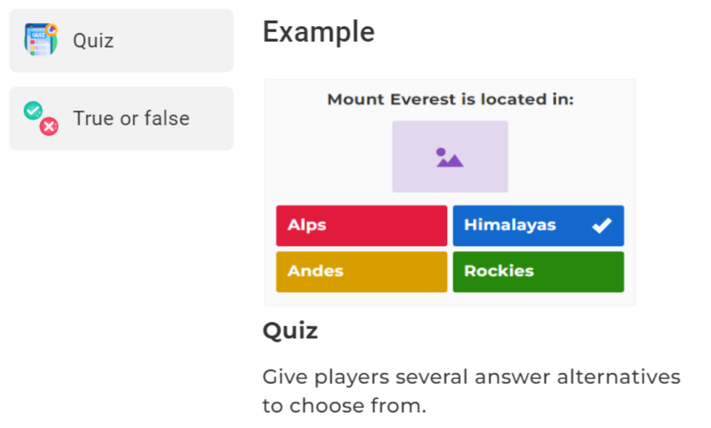        |
|                    Report Screen                    |            Report Player Detail Screen            |            Report Detail Question Screen            |
|         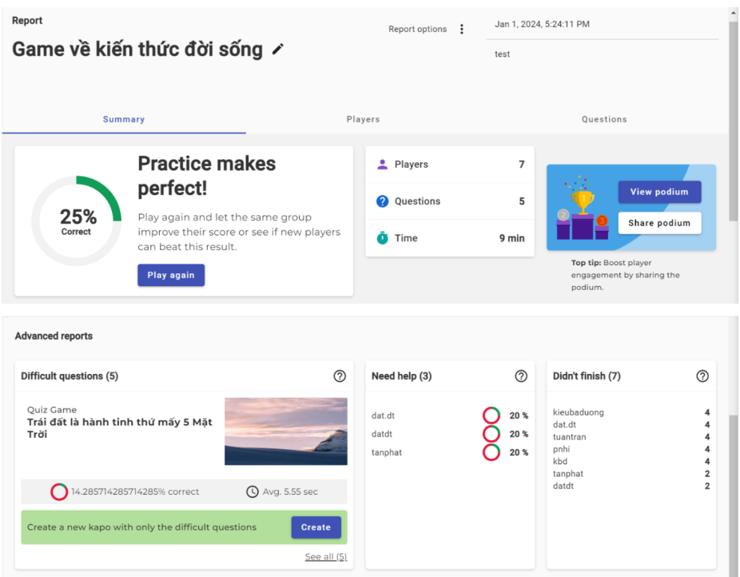         | 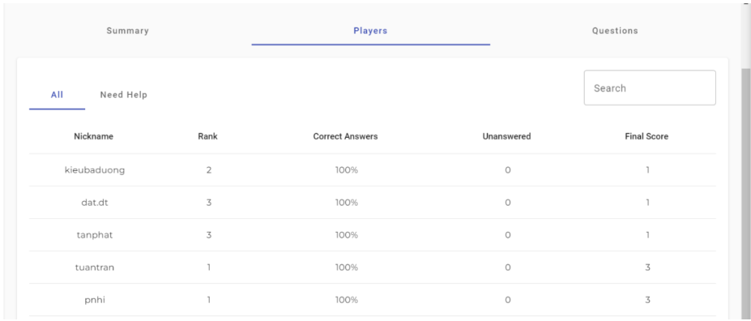 | 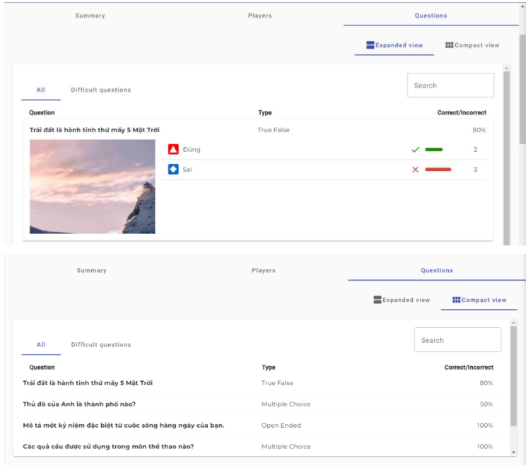 |
|            Report Question Detail Screen            |                  Validate Screen                  |                  Game Login Screen                  |
| 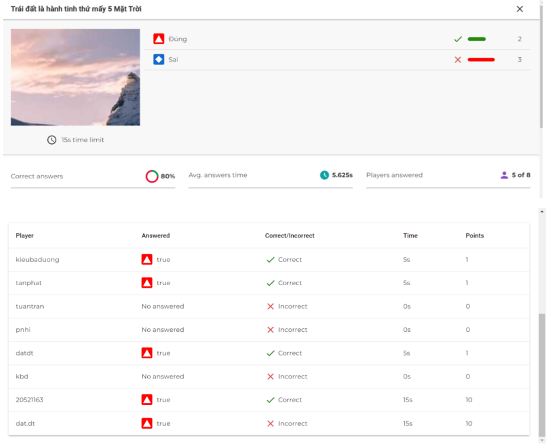 |       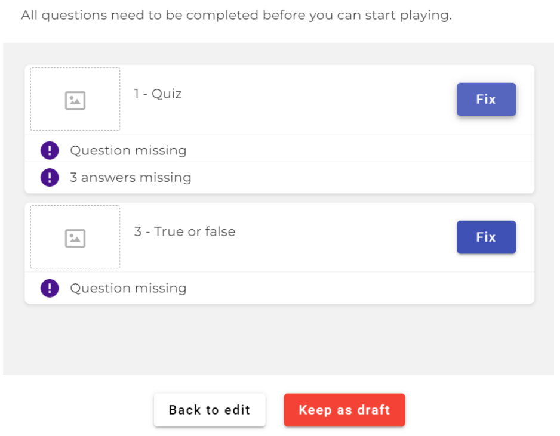       |       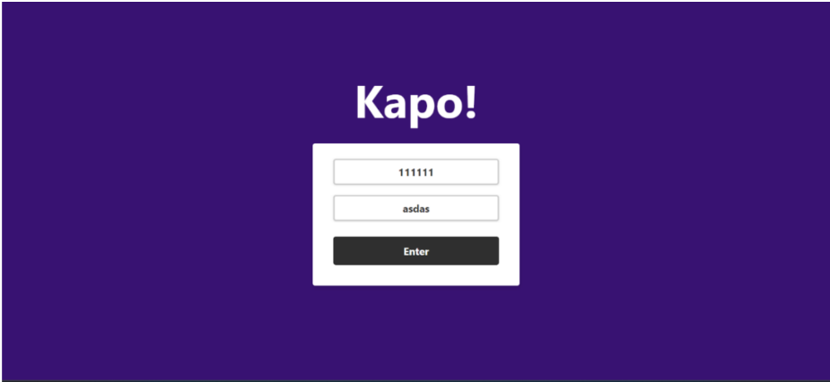       |
|                     Host Screen                     |                   Lobby Screen                    |
|          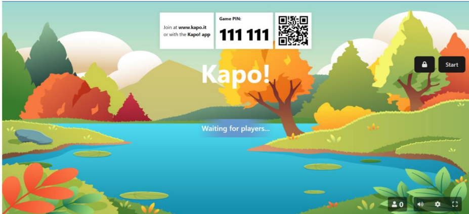          |        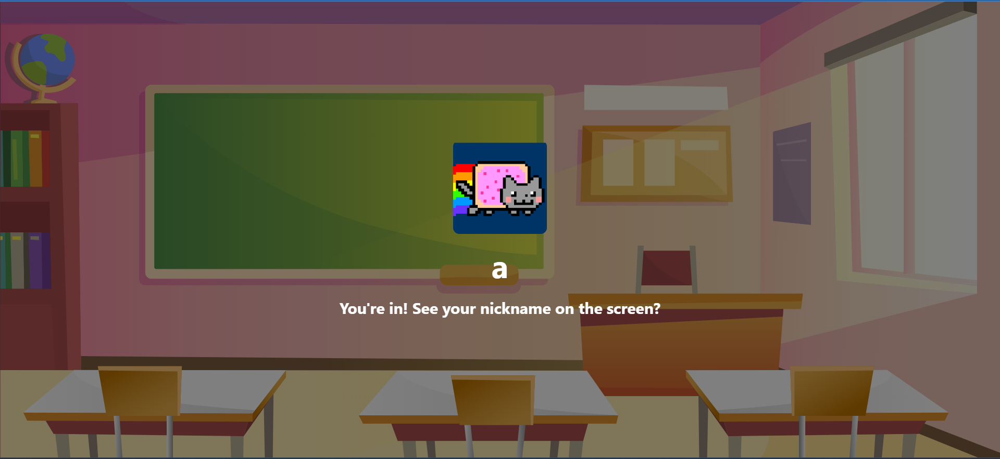         |

## Prerequisites

- Angular CLI 16.0.0
- Node.js 16.13.0
